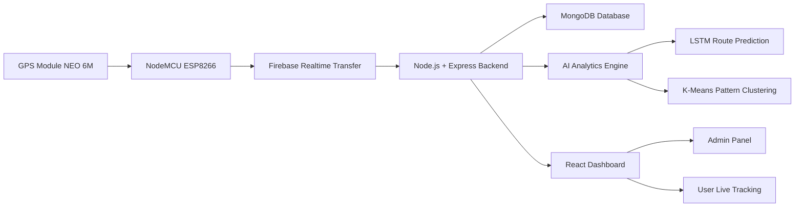
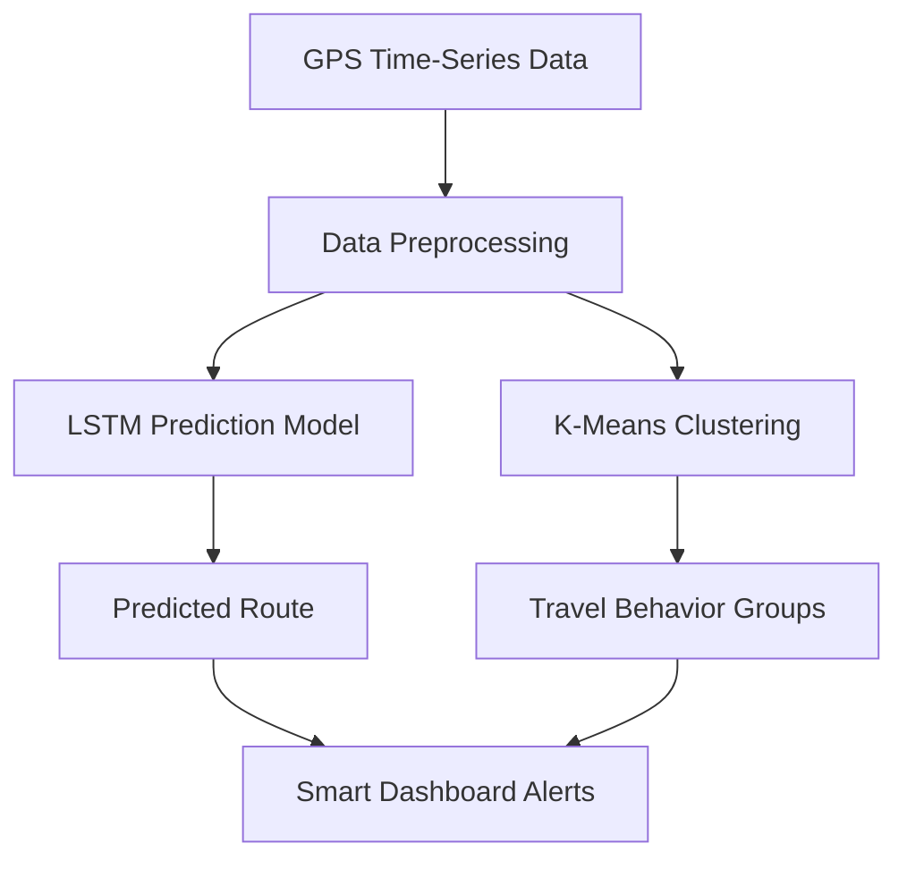

# TracePoint – AI-Enhanced IoT Live Bus Tracking System  
**Team Project | Led by Md. Moniruzzaman Sojol**

TracePoint is a **team-led IoT and AI-driven smart transportation project** developed to provide **real-time live location tracking for university buses**, improve passenger convenience, and enhance transportation safety through intelligent monitoring.

As the **team leader**, I led the **system architecture design, project planning, AI model roadmap, and full-stack ecosystem integration**, coordinating both the hardware and software development workflow.

---

## 👨‍💼 Leadership & Project Role
**Role:** Team Leader  

**Key Contributions:**
- Led the end-to-end project design and technical planning
- Coordinated team members across **hardware, backend, frontend, and AI modules**
- Designed the **IoT data flow architecture**
- Planned the **AI analytics pipeline** for route prediction and clustering
- Supervised MERN stack and Firebase integration
- Oversaw testing, debugging, and deployment workflow

---

## 🌐 Project Overview
TracePoint is an **IoT-based live bus tracking ecosystem** that combines embedded hardware, cloud-based real-time communication, and a web dashboard.

The system enables:
- **Live location tracking** of university buses
- **Driver information management**
- **Admin and user authentication**
- **Real-time monitoring dashboard**
- **Future AI-powered route intelligence**

---

## 🛰️ Device Technology
- NodeMCU WiFi Module  
- GPS Module NEO 6-M  
- Connecting Wires  

---

## 💻 Technology Stack

### Frontend
- React.js  
- Bootstrap  
- Font Awesome  
- Framer Motion  
- CSS  

### Backend
- Node.js  
- Express.js  
- MongoDB  
- Firebase Realtime Data Transfer  

---

## 🧩 System Ecosystem

---

## 🧠 AI Model Roadmap (Under Development)
The AI module is currently under active development.

Planned features include:

- **LSTM / RNN** for route prediction and ETA forecasting
- **K-Means Clustering** for travel pattern analysis
- **Anomaly detection** for route deviation alerts
- **Driver behavior analytics**

### AI Workflow

---

## 📈 Development Status
- [x] IoT hardware prototype completed
- [x] Live tracking dashboard developed
- [x] Authentication system integrated
- [x] Cloud real-time data transfer
- [x] AI model training pipeline
- [x] Predictive analytics deployment

---

## 🎯 Vision
TracePoint is being developed as a **smart transportation ecosystem** that bridges **IoT, cloud computing, and AI** to transform conventional university bus tracking into an intelligent predictive system.
# Device(Cont.)

